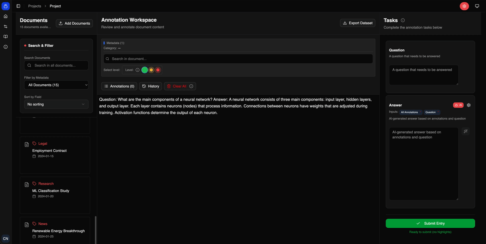

<div align="center">

# AIANO

**Enhancing Information Retrieval with AI-Augmented Annotation**

[](LICENSE)
[](https://www.python.org/)
[](https://nodejs.org/)
[](https://fastapi.tiangolo.com/)
[](https://react.dev/)

[**Quick Start**](#quick-start) | [**Explore the Paper**](https://www.arxiv.org/abs/2602.04579) | [**Cite AIANO**](#citing)

<br />

<p align="center">
  
</p>

*Streamline your dataset creation with intelligent AI assistance and intuitive human-in-the-loop workflows.*

</div>

---

AIANO is an AI-native annotation platform designed to streamline the creation of high-quality datasets for information retrieval tasks, such as RAG evaluation and machine learning model training. Built entirely with open-source technologies, it combines intelligent AI assistance with intuitive manual annotation workflows to make dataset creation faster, more consistent, and more efficient.

## Quick Start

The fastest way to get AIANO running is using **Docker Compose**.

### 1. Prerequisites
- [Docker & Docker Compose](https://docs.docker.com/get-docker/)

### 2. Setup & Launch
```bash
# Clone the repository
git clone https://github.com/TIO-IKIM/AIANO.git
cd AIANO

# Initialize environment files
cp api/.env.example api/.env
cp ui/.env.example ui/.env

# Build and start all services
docker compose up --build -d
```

Access the platform at:
- **Frontend**: [http://localhost:3000](http://localhost:3000)
- **Backend API**: [http://localhost:8000/docs](http://localhost:8000/docs)

---

## Features

- **🤖 Native AI Integration** – Works with any OpenAI-compatible API provider (Local or Cloud).
- **📂 Multi-Document Management** – Seamlessly manage multiple documents within a single project.
- **🔍 Advanced Search** – Quickly locate and filter content for precise annotations.
- **⚡ Smart Annotations** – High-speed highlighting with customizable relevancy levels.
- **🧩 AIANO Blocks** – A modular paradigm for human–AI collaborative annotation.

### 🧩 AIANO Blocks: Three Interaction Modes

AIANO Blocks support flexible annotation workflows across three distinct modes:

| Mode | Description |
| :--- | :--- |
| **Plain Mode** | Traditional manual annotation without AI assistance. |
| **Solo AI Mode** | Tasks are pre-filled with AI-generated suggestions for human review. |
| **Human–AI Mode** | Collaborative mode where AI and human inputs are combined. |

---

## Development Setup

If you prefer to run the components manually outside of Docker:

### Backend (FastAPI)
```bash
cd api
uv sync
uv run alembic upgrade head
uv run uvicorn src.main:app --reload
```

### Frontend (React)
```bash
cd ui
yarn install
yarn dev
```

---

## Project Structure

```text
aiano/
├── api/                # Python Backend (FastAPI + SQLAlchemy)
│   ├── src/            # Core application logic & routes
│   └── alembic/        # Database migration history
├── ui/                 # React Frontend (TypeScript + Vite)
│   └── src/            # Components, containers, and services
└── docs/               # Project documentation & assets
```

---

## Core Technologies

- **Frontend**: React 19, TanStack Router, Zustand, Tailwind CSS.
- **Backend**: FastAPI, SQLAlchemy, Alembic, Pydantic.
- **Database**: PostgreSQL.
- **Infrastructure**: Docker, Docker Compose.

---

## Troubleshooting

Encountering issues? Check our [Troubleshooting & Debugging Guide](docs/troubleshooting.md) for solutions to common database, migration, and build problems.

---

## Citing

If you use AIANO in your research, please cite our work:

```bibtex
@misc{khattab2026aianoenhancinginformationretrieval,
      title={AIANO: Enhancing Information Retrieval with AI-Augmented Annotation}, 
      author={Sameh Khattab and Marie Bauer and Lukas Heine and Till Rostalski and Jens Kleesiek and Julian Friedrich},
      year={2026},
      eprint={2602.04579},
      archivePrefix={arXiv},
      primaryClass={cs.IR},
      url={https://arxiv.org/abs/2602.04579}, 
}
```

---

## 📄 License

AIANO is released under the **Apache License 2.0**. See the [LICENSE](LICENSE) file for more details.

---
